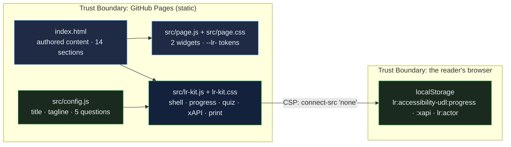

# Accessibility & UDL Toolkit for Educators: a graduate-level guide to accessible teaching from the legal case to a remediation roadmap, with a self-audit scorer and a WCAG contrast checker

[](https://github.com/Freddricklogan/accessibility-udl/actions/workflows/deploy.yml)
[](#5-getting-started--verification)
[](https://github.com/Freddricklogan/accessibility-udl/actions/workflows/codeql.yml)
[](LICENSE)
[](https://freddricklogan.github.io/accessibility-udl/)

## 1. Executive Summary & Business Impact

**Problem statement.** Faculty and instructional designers receive an accommodation letter, a complaint, or a procurement form and discover that their syllabus is a scanned PDF, their slides have no headings, their videos have auto-captions nobody checked, and their equations are pictures. The standard exists — WCAG, UDL, Section 508 — but it reaches them as a checklist of 87 criteria rather than a small number of habits and two tools they can use today.

**Solution & value delivered.** A fourteen-section resource that opens with the legal and ethical case, explains WCAG through the POUR principles and a plain-language selection of success criteria, sets out CAST's UDL framework and full guidelines, shows how assistive technologies actually reach content, and turns the standard into practice for documents, STEM material and video, with accessibility statements and VPATs for procurement and a priority-ordered roadmap for an existing course — anchored by a self-audit scorer across POUR and a contrast checker that computes the exact WCAG ratio from relative luminance. The page is one of ten
resources built on the shared
[Learning Resource Kit](https://github.com/Freddricklogan/learning-resource-kit):
an Executive Shell with live counts, collapsible sections whose progress is
saved in the reader's browser, a five-question quiz written for this
resource that records xAPI 1.0.3 statements locally, and a print layout that
opens every section. Nothing leaves the page; the content-security policy
forbids network calls.

**[→ Read the full case study](docs/CASE_STUDY.md)**

| Outcome | How this repo delivers it |
| --- | --- |
| A resource, not a slide deck | 14 sections (17 minutes at 230 wpm) with an executive summary first: why accessibility, WCAG and POUR, success criteria, self-audit, contrast checker, the UDL framework, full UDL guidelines, assistive technologies, accessible documents, STEM, data and images, video and audio, statements and the VPAT, roadmap, glossary |
| Interactive where it matters | 2 authored widgets (see §4) kept intact through the conversion and verified under a strict CSP |
| Evidence of learning | Quiz answers and completion recorded as xAPI statements with an anonymous actor; inspectable on the page |
| Reviewable by an institution | No inline script or style, typed buttons, table bodies, a `<main>` landmark; html-validate and ESLint in CI |
| Usable everywhere | Keyboard-operable sections, deep links that open their section, print stylesheet, no horizontal scroll at 400 px |

## 2. Demonstrated Competencies & Technical Skills

- **EdTech & Human-Centered Design** — practice over compliance: the audit reads as habits, not criteria numbers; the contrast checker shows the same arithmetic a formal audit uses so the threshold stops being a mystery; the page practises what it teaches — native checkboxes, real headings, a main landmark and a strict policy — and the conversion audit records the fixes.
- **Systems Architecture & CS** — authored content in `index.html`, its
  widgets in `src/page.js`, its styles in `src/page.css` under the `--lr-`
  namespace; the kit vendored as `src/lr-kit.js`; config and tests that
  fail CI if a quiz question is malformed.
- **Cybersecurity & Compliance** — `default-src 'none'; script-src 'self';
  connect-src 'none'`; no third-party script; Trivy, npm audit and CodeQL in
  CI.
- **Data Science & AI** — reading time and section counts computed from the
  content at load; scores recorded as scaled results, never claimed.

## 3. System Architecture & Data Flow



## 4. Technical Highlights & Engineering Decisions

### The authored widgets

| Widget | What it does |
| --- | --- |
| Accessibility self-audit | Ten weighted practices across POUR as native checkboxes; fills a bar and gives an Emerging / Developing / Strong / Comprehensive verdict with the next fixes named |
| Colour contrast checker | Foreground and background hex inputs; computes the WCAG ratio from relative luminance and reports pass or fail for AA and AAA normal and large text and for UI components |

### ADR-1 — Convert, do not rewrite

**Context.** The original was one hand-authored file: rich content and
bespoke widgets, but inline styles and scripts that no content-security
policy or validator accepts.

**Decision.** The kit's converter moved the stylesheet and scripts out of
the page, replaced 65 inline style attributes with
21 generated classes, namespaced 26 custom properties, typed
0 buttons, gave 0 tables a body and kept the existing `<main>` landmark. The content and
widget code were not rewritten; `AUDIT.md` lists every change.

**Consequence.** The page passes html-validate under a strict CSP with its
original behaviour intact, and the change is auditable line by line.

### ADR-2 — One quiz, one attempt, standard statements

**Context.** The page's own self-checks vanish on reload and record nothing.

**Decision.** Five questions written from this resource's content live in
`src/config.js`; the kit accepts a single attempt per question, shows the
explanation, and records xAPI *answered* and *completed* statements with a
scaled score, kept in the browser and shown as JSON.

**Consequence.** The score reflects what the reader knew before the
explanation, and an institution can see the exact statements a learning
record store would receive.

### ADR-3 — Progress means opened

**Context.** Scroll depth is easy to measure and says little about reading.

**Decision.** A section counts as opened when its collapsed state is
removed — by click, keyboard, deep link or "Expand all" — and an
*experienced* statement is recorded once.

**Consequence.** The KPI strip is conservative: 14 sections, and the count
only rises when the reader opens one.

## 5. Getting Started & Verification

**Prerequisites.** Node 22 for the checks; the page itself needs only a
browser.

```bash
git clone https://github.com/Freddricklogan/accessibility-udl.git
cd accessibility-udl
npm ci
npm run check     # eslint → html-validate → vitest
npx serve .       # open http://localhost:3000
```

**Verification — the numbers this repository actually produced:**

```bash
npm run lint      # 0 problems
npm run validate  # html-validate index.html: clean
npm run coverage  # 7 passed; All files 79.84% (config.js 100%, vendored lr-kit.js 78.75%)
```

| Check | Result |
| --- | --- |
| Unit tests (Vitest, jsdom) | **7 passed / 7** across 2 files — quiz validity, page invariants, the kit mounted on this page |
| Coverage | All files **79.84%** statements: `src/config.js` 100%, vendored `src/lr-kit.js` 78.75% from this page's smoke test (the kit's own suite covers it at 99%) |
| ESLint, html-validate | clean |
| Conversion audit | 65 inline styles → 21 classes · 26 tokens namespaced · 0 buttons typed · 0 tables fixed |
| Headless Chrome smoke | **0 console errors**; all 2 widgets exercised; sections opened 14/14 on Expand all; no horizontal scroll at 1200 or 400 px |

## 6. Live Demo & Production Showcase

**<https://freddricklogan.github.io/accessibility-udl/>**

**30-second guided walkthrough.** Press **Take the 30-second tour**.

1. **A graduate-level resource, not a slide deck** — 14 sections, about
   17 minutes of reading.
2. **Open a section** — the first section opens and the count rises.
3. **Check your understanding** — five questions on POUR, contrast thresholds, UDL, MathML and procurement documents.
4. **Your statements, inspectable** — the xAPI JSON recorded in this browser.

The quiz covers:
- the POUR principles
- AA contrast thresholds
- UDL's three principles
- accessible mathematics
- statements versus VPATs

Part of the resource hub at <https://freddricklogan.github.io/resources/>.
